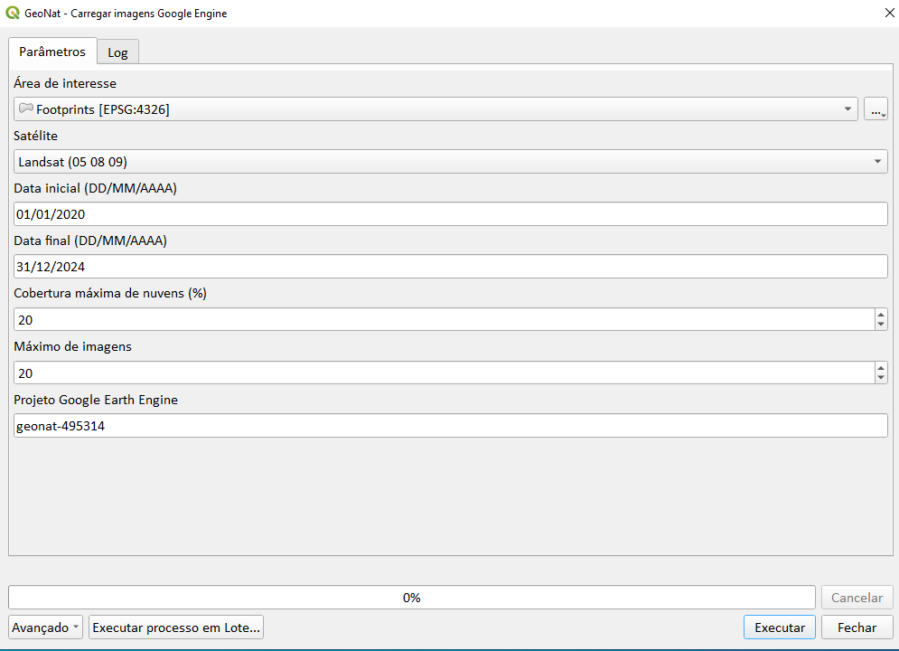
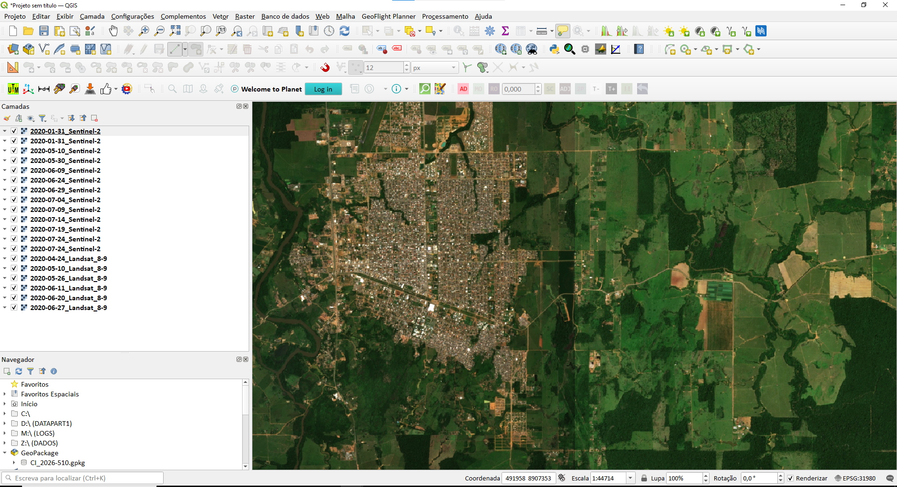

# GeoNat EarthEngine Loader

<p align="center">


</p>

---

## Overview

**GeoNat EarthEngine Loader** is a PyQGIS processing tool designed to automate temporal satellite imagery loading directly from Google Earth Engine into QGIS.

The tool was developed for operational geospatial workflows focused on:

- Environmental monitoring
- Remote sensing analysis
- Temporal imagery inspection
- Deforestation assessment
- GIS automation

---

## Supported Satellites

### Landsat Collection 2 Level 2

- Landsat 5
- Landsat 8
- Landsat 9

### Sentinel

- Sentinel-2 SR Harmonized

---

## Features

### Temporal Filtering

Select:

- Start date
- End date

---

### Cloud Coverage Filtering

Automatic filtering using:

- `CLOUD_COVER`
- `CLOUDY_PIXEL_PERCENTAGE`

---

### Automatic Cloud Masking

Supported masks:

- `QA_PIXEL`
- `QA60`

---

### Automatic RGB Rendering

#### Landsat 8/9

| Band | Channel |
|---|---|
| SR_B4 | Red |
| SR_B3 | Green |
| SR_B2 | Blue |

---

#### Sentinel-2

| Band | Channel |
|---|---|
| B4 | Red |
| B3 | Green |
| B2 | Blue |

---

### Automatic XYZ Layer Loading

The tool automatically:

- Creates XYZ raster layers
- Organizes imagery in QGIS
- Loads temporal scenes dynamically
- Supports operational workflows

---

## Technologies

- Python
- PyQGIS
- Google Earth Engine API
- QGIS Processing Framework
- GDAL

---

## Installation

### Clone Repository

```bash
git clone https://github.com/CleberSebrian/GeoNat-EarthEngine-Loader.git
```

---

### Install Dependencies

```bash
pip install earthengine-api
```

---

### Authenticate Earth Engine

```bash
earthengine authenticate
```

---

### Add Script to QGIS

1. Open QGIS
2. Open Processing Toolbox
3. Go to Scripts
4. Add Script to Toolbox
5. Select:

```text
earthengine_loader.py
```

---

## Usage Workflow

1. Select Area of Interest
2. Choose satellite source
3. Define temporal interval
4. Set cloud coverage threshold
5. Execute algorithm
6. Load temporal imagery into QGIS

---

## Screenshots

### QGIS Processing Tool



---

### Temporal Imagery Visualization



---

## Use Cases

- Environmental monitoring
- Deforestation analysis
- Temporal satellite inspection
- Rural property monitoring
- GIS operational workflows
- Remote sensing automation
- Environmental auditing

---

## Repository Structure

```text
GeoNat-EarthEngine-Loader/
│
├── README.md
├── LICENSE
├── requirements.txt
├── earthengine_loader.py
└── images/
```

---

## Future Improvements

Planned features:

- NDVI generation
- NBR support
- Temporal Controller integration
- GeoTIFF export
- Local imagery cache
- Full QGIS plugin version
- Multi-sensor visualization

---

## License

This project is licensed under the MIT License.

---

## Author

### Cleber Sebrian

GIS Developer focused on:

- PyQGIS
- Remote Sensing
- Google Earth Engine
- GIS Automation
- Environmental Monitoring

---

## Keywords

`QGIS` `PyQGIS` `Python` `Earth Engine` `GIS` `Remote Sensing` `Landsat` `Sentinel-2` `Environmental Monitoring`
